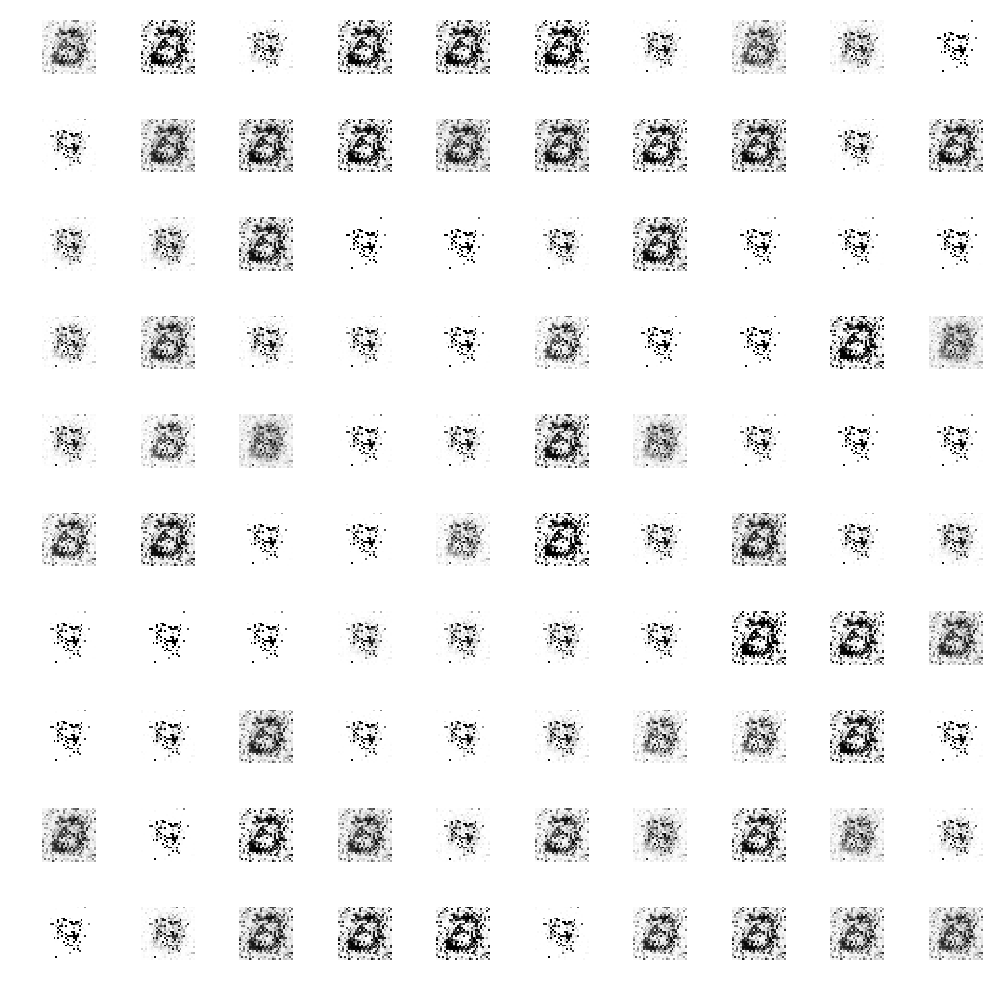
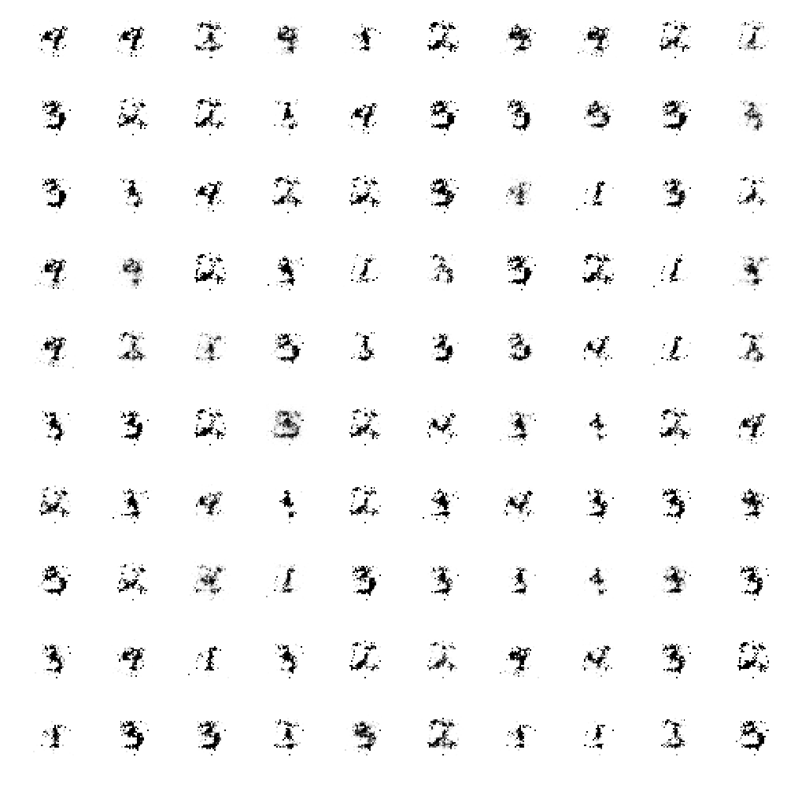
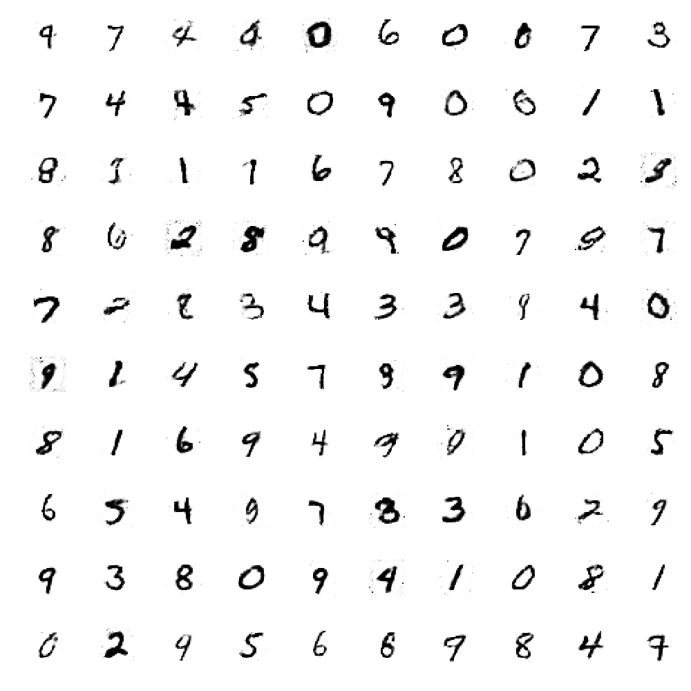

<div align="center">
    <br>
    <h1>PyVacy: Privacy Algorithms for PyTorch</h1>
</div>

Basically [TensorFlow Privacy](https://github.com/tensorflow/privacy), but for PyTorch.

## Example Usage

```python
from pyvacy import optim, analysis, sampling

training_parameters = {
    'N': len(train_dataset),
    # An upper bound on the L2 norm of each gradient update.
    # A good rule of thumb is to use the median of the L2 norms observed
    # throughout a non-private training loop.
    'l2_norm_clip': 1.0,
    # A coefficient used to scale the standard deviation of the noise applied to gradients.
    'noise_multiplier': 1.1,
    # Each example is given probability of being selected with minibatch_size / N.
    # Hence this value is only the expected size of each minibatch, not the actual. 
    'minibatch_size': 128,
    # Each minibatch is partitioned into distinct groups of this size.
    # The smaller this value, the less noise that needs to be applied to achieve
    # the same privacy, and likely faster convergence. Although this will increase the runtime.
    'microbatch_size': 1,
    # The usual privacy parameter for (ε,δ)-Differential Privacy.
    # A generic selection for this value is 1/(N^1.1), but it's very application dependent.
    'delta': 1e-5,
    # The number of minibatches to process in the training loop.
    'iterations': 15000,
}

model = nn.Sequential(...)
optimizer = optim.DPSGD(params=model.parameters(), **training_parameters) 
epsilon = analysis.epsilon(**training_parameters)
loss_function = ...

minibatch_loader, microbatch_loader = sampling.get_data_loaders(**training_parameters)
for X_minibatch, y_minibatch in minibatch_loader(train_dataset):
    optimizer.zero_grad()
    for X_microbatch, y_microbatch in microbatch_loader(TensorDataset(X_minibatch, y_minibatch)):
        optimizer.zero_microbatch_grad()
        loss = loss_function(model(X_microbatch), y_microbatch)
        loss.backward()
        optimizer.microbatch_step()
    optimizer.step()
```

## Tutorials

`mnist.py`

Implements a basic classifier for identifying which digit a given MNIST image corresponds to. The model achieves a test set classification accuracy of 96.7%. The model architecture and results achieved are inspired by the corresponding tutorial within [TensorFlow privacy](https://github.com/tensorflow/privacy/tree/master/tutorials).

`gan.py`

Implements a Wasserstein GAN, in which the discriminator is trained via differentially private stochastic gradient descent. Generated images are plotted as a function of increasing epsilon (ɛ = 0.8, 3.0, 8.0).

<div align="center">
    
    
    
</div>

## Disclaimer

Do NOT use the contents of this repository in applications which handle sensitive data. The author accepts no liability for privacy infringements - use the contents of this repository solely at your own discretion.
